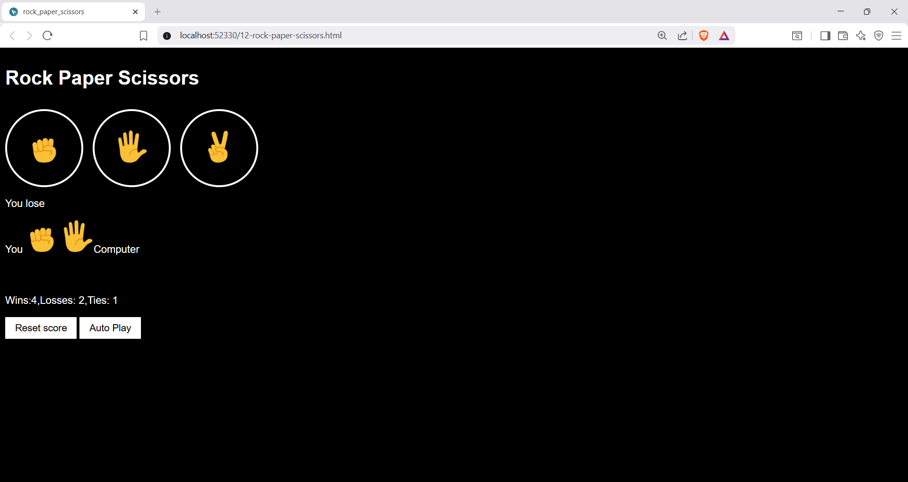

🎮 Rock Paper Scissors
----------------------------------------------------------------------------------------------------------------------------------

A classic game, rebuilt with JavaScript and enhanced with interactive features.

About the Project
---------------------------------------------------------------------------------------------------------------------------------

This project is my JavaScript implementation of the classic Rock Paper Scissors game. The goal was not only to recreate the game but also to practice building interactive web applications using DOM manipulation.

The player competes against the computer, which generates a random move every round. To make the experience more engaging, I extended the game with features like Auto Play, Reset Score, and persistent score storage using Local Storage.

✨ Highlights
----------------------------------------------------------------------------------------------------------------------------------

-> Play against the computer.

 ->Random computer move generation.

 ->Instant win, lose, or tie results.

 ->Auto Play mode.

 ->Live score tracking.

 ->Score persistence with Local Storage.

 ->One-click Reset Score feature.

 ->Clean and responsive user interface.

 Built With
 ---------------------------------------------------------------------------------------------------------------------------------

- HTML5
- CSS3
- JavaScript (ES6)
- DOM Manipulation
- Browser Local Storage

 What I Learned
 ------------------------------------------------------------------------------------------------------------------------------

- Working with JavaScript functions and objects.
- Handling user interactions through events.
- Updating the DOM dynamically.
- Using conditional logic and random number generation.
- Storing and retrieving data with Local Storage.
- Building a complete interactive frontend project.

 Screenshots
 -------------------------------------------------------------------------------------------------------------------------------

Main Interface

Gameplay

Auto Play Mode

Reset Score

Demo
-------------------------------------------------------------------------------------------------------------------------------------

Watch the complete demo to see the project in action.[Watch the Demo on
LinkedIn](https://www.linkedin.com/posts/darameghana_rock-paper-scissors-project-overview-ugcPost-7469322612402278400-4Mut/?utm_source=share&utm_medium=member_desktop&rcm=ACoAAF_WDeEBC0fVi7tVEh3ksFR2CTX--PYKJdo)

 Future enhancements
 --------------------------------------------------------------------------------------------------------------------------------

- Keyboard shortcuts.
- Sound effects and animations.
- Mobile optimization.
- Game history tracking.
- Additional gameplay modes.

⭐ Final Note
--------------------------------------------------------------------------------------------------------------------------------

Building this project helped me understand how JavaScript can transform a simple webpage into an interactive application. Every feature added was another opportunity to explore real-world frontend development concepts.

If you enjoyed checking out this project, feel free to leave a ⭐ on the repository!